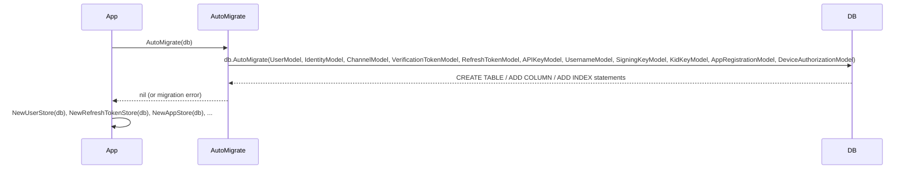
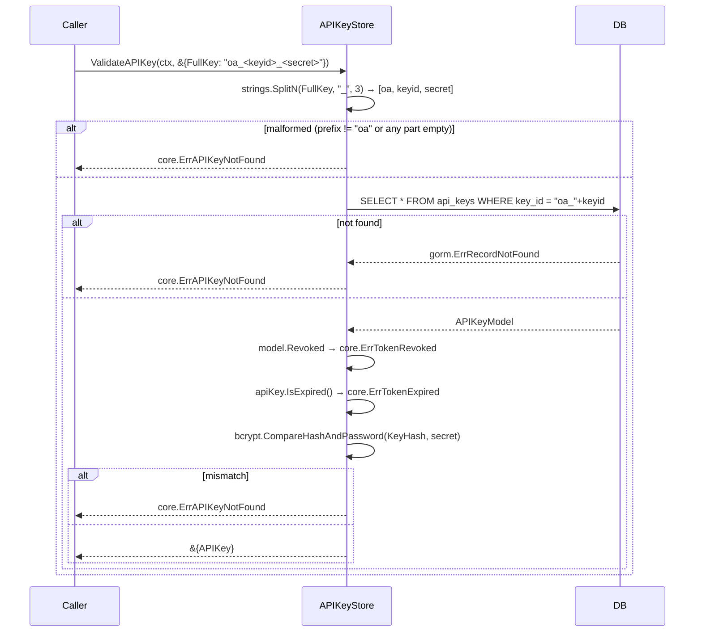
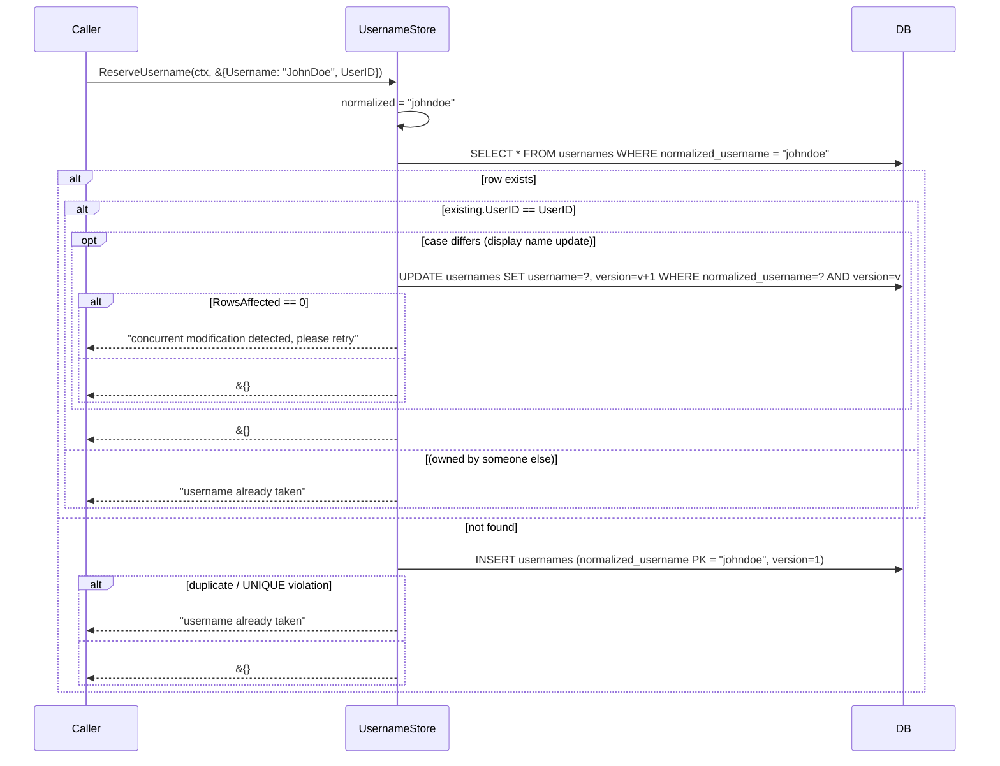
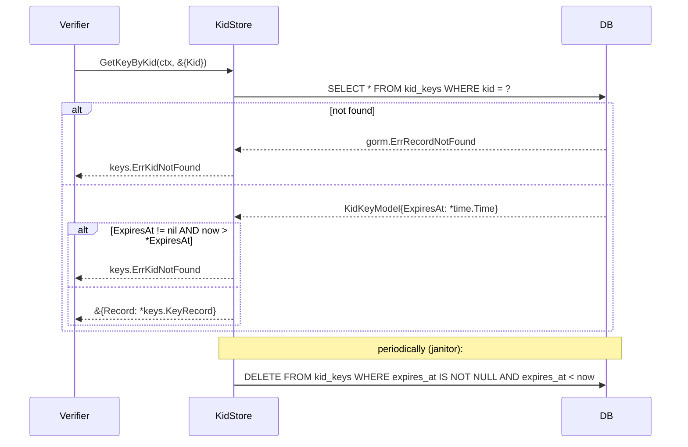

# gorm

GORM/SQL-backed implementations of every oneauth store interface — `KeyStorage`, `KidStorage`, `UserStore`, `IdentityStore`, `ChannelStore`, `UsernameStore`, `AppRegistrationStore`, `RefreshTokenStore`, `APIKeyStore`, `DeviceAuthorizationStore`, and the localauth verification-token store — all wired on the project-wide gRPC-shape contract `MethodName(ctx context.Context, req *XRequest) (*XResponse, error)` and all routed through `db.WithContext(ctx)` so caller cancellation propagates into the SQL driver. A single `AutoMigrate` runs every migration centrally; consumers who don't need a relational backend pay nothing because `stores/gorm/` lives in its own sub-module gated on `!wasm`.

Three design moves keep the surface portable. (1) JSON columns are encoded via custom `driver.Valuer`/`Scanner` types (`JSONMap`, `StringSlice`, `AuthorizationDetailsJSON`) on the older models, or via GORM's built-in `serializer:json` tag on the newer `AppRegistrationModel` — both avoid DB-specific JSONB helpers, so the same schema runs on SQLite for tests and Postgres for production. (2) Refresh tokens are persisted hash-only with the raw value held in memory (`gorm:"-"` on `Token`), and rotation runs inside `db.Transaction` for atomic revoke-old + create-new with the family preserved — this is what makes RFC 6749 §10.4 reuse detection safe under concurrent rotation. (3) The username store layers two concurrency mechanisms: PK uniqueness on `normalized_username` catches insert races, and a `Version` column + `WHERE version = ?` updates catch update races; callers retry on conflict.

`gorm.ErrRecordNotFound` is translated to store-specific sentinels at each boundary — `keys.ErrKeyNotFound`, `keys.ErrKidNotFound`, `core.ErrTokenNotFound`, `core.ErrAPIKeyNotFound`, `admin.ErrAppNotFound`, or wrapped `fmt.Errorf("…not found")` — so callers can pattern-match against the interface package's contract without knowing the backend.

## Contents

- [Entities](#entities)
- [Flows](#flows)
  - [AutoMigrate startup](#automigrate-startup)
  - [Refresh-token rotation under transaction](#refresh-token-rotation-under-transaction)
  - [API-key validation](#api-key-validation)
  - [Username reservation with optimistic concurrency](#username-reservation-with-optimistic-concurrency)
  - [Kid grace lookup and cleanup](#kid-grace-lookup-and-cleanup)
- [Gotchas](#gotchas)
- [Depends on](#depends-on)

## Entities

| Entity | Kind | Role | Why |
|---|---|---|---|
| `AutoMigrate` | func | Runs `db.AutoMigrate` for all ten oneauth GORM models in one call. | Single central migration entrypoint; callers MUST invoke it (or equivalent SQL migration) before any store is used. |
| `JSONMap` | type | `map[string]any` with `driver.Valuer`/`Scanner` that JSON-encodes into a single column. | Lets profile/credentials/device-info round-trip through `jsonb` portably; `Scan` silently no-ops on non-`[]byte` input. |
| `StringSlice` | type | `[]string` with `Valuer`/`Scanner` that JSON-encodes into one column. | Avoids a join table for scope lists; portable across SQLite/MySQL/Postgres. |
| `AuthorizationDetailsJSON` | type | `[]core.AuthorizationDetail` with `Valuer`/`Scanner` for RFC 9396 details as `jsonb`. | Stores rich authorization details inline on the refresh-token row so rotation copies them by value. |
| `UserModel` | struct | GORM model for the `users` table (`ID`, `IsActive`, `Profile JSONMap`, `Version`). | `Profile` is JSON-typed; `Version` is reserved for future optimistic locking. |
| `IdentityModel` | struct | GORM model for `identities`, keyed by `(Type, Value)` composite PK with a `UserID` index. | Composite PK enforces one row per `(type, value)`; `IdentityModel.ToIdentity` / `IdentityToModel` bridge to `accounts.Identity`. |
| `ChannelModel` | struct | GORM model for `channels`, keyed by `(Provider, IdentityKey)`; `Credentials`/`Profile` are `JSONMap`. | Composite PK matches the in-memory store; `ExpiresAt` is indexed so channel-auth expiry can be swept. |
| `VerificationTokenModel` | struct | GORM model for email-verification/password-reset tokens, keyed by the raw `Token` (table `auth_tokens`). | Short-lived single-use tokens; stored plaintext (unlike refresh tokens) because they expire fast and are one-use. |
| `RefreshTokenModel` | struct | GORM model for refresh tokens, keyed by `TokenHash` with indexed `Family`/`Subject`/`ExpiresAt`/`Revoked`; `Token` is gorm-ignored. | Only the SHA-256 hash is persisted (`gorm:"-"` on `Token`); supports family-wide revocation for reuse detection. |
| `APIKeyModel` | struct | GORM model for API keys, keyed by `KeyID` storing a bcrypt `KeyHash`. | Secret never persisted; bcrypt hash validated at lookup time; `ExpiresAt` nullable for non-expiring keys. |
| `UsernameModel` | struct | GORM model mapping `NormalizedUsername` (lowercase PK) to `UserID` with a `Version` column. | Lowercase normalized PK gives case-insensitive uniqueness via the DB constraint; original-case copy retained for display. |
| `SigningKeyModel` | struct | GORM model for per-client signing keys, keyed by `ClientID` with a unique `Kid` index. | Stores symmetric/asymmetric key bytes + algorithm + kid; unique kid index supports JWKS lookup. |
| `KidKeyModel` | struct | GORM model for the kid grace cache, keyed by `Kid` with a nullable `ExpiresAt`. | Nullable expiry avoids the messy `0001-01-01` zero-date some SQL dialects produce; matches the in-memory `KidStore` contract. |
| `AppRegistrationModel` | struct | GORM model for app registrations (RFC 7591/7592) including `RegistrationAccessToken` + `RegistrationClientURI`. | Slice fields use `serializer:json` so it works identically across SQLite/MySQL/Postgres without DB-specific JSONB quirks. |
| `DeviceAuthorizationModel` | struct | GORM model for RFC 8628 device authorizations, keyed by `DeviceCode` with indexed `UserCodeUpper` (case/dash-normalized lookup), `ClientID`, and `ExpiresAt`. Mirrors `core.DeviceAuthorization`. | Denormalized `UserCodeUpper` over a functional index keeps the schema portable across SQLite/MySQL/Postgres. `LastPolledAt` is nullable so a never-polled record doesn't drag the zero-date sentinel through the DB. |
| `GORMUser` | struct | Thin wrapper around `UserModel` that satisfies `accounts.User` (`Id`, `Profile`). | Keeps `accounts.User` interface-only; GORM model stays a pure persistence struct. |
| `UserStore` | struct | `accounts.UserStore` over GORM. | `UserStore.CreateUser` / `UserStore.GetUserById` / `UserStore.SaveUser` on the `(ctx, *Req)` shape; returns `"user not found: <id>"` on miss. |
| `IdentityStore` | struct | `accounts.IdentityStore` over GORM with optional create-on-miss. | `IdentityStore.GetIdentity(CreateIfMissing=true)` is the upsert path used during signup/OAuth callback. |
| `ChannelStore` | struct | `accounts.ChannelStore` over GORM with create-on-miss for new provider/identity pairs. | Mirrors `IdentityStore` semantics for the `(provider, identity_key)` authentication channel. |
| `TokenStore` | struct | `localauth.VerificationTokenStore` for short-lived verification/reset tokens. | `TokenStore.GetToken` auto-deletes expired rows on read (best-effort cleanup without a sweeper). |
| `RefreshTokenStore` | struct | `core.RefreshTokenStore` over GORM with SHA-256 hashing and transactional rotation. | `RefreshTokenStore.RotateRefreshToken` runs in `db.Transaction` so RFC 6749 §10.4 reuse detection is safe under concurrent attempts. |
| `APIKeyStore` | struct | `core.APIKeyStore` over GORM; mints `oa_<keyid>_<secret>`, stores bcrypt hash. | `APIKeyStore.ValidateAPIKey` checks revoked/expired before invoking bcrypt; plaintext secret never persisted. |
| `UsernameStore` | struct | `accounts.UsernameStore` over GORM with optimistic-concurrency Reserve/Change/Release/Get. | `Version` + `WHERE version = ?` updates plus PK uniqueness; `UsernameStore.ChangeUsername` best-effort restores the old row on race. |
| `KeyStore` | struct | `keys.KeyStorage` over GORM (`PutKey`/`DeleteKey`/`GetKey`/`GetKeyByKid`/`ListKeyIDs`). | `KeyStore.PutKey` calls `utils.ComputeKid` automatically if the caller does not supply a kid; unique kid index enforced at the DB. |
| `KidStore` | struct | `keys.KidStorage` over GORM (`Add` upsert, `Remove` idempotent, `GetKeyByKid` filters expired, `CleanExpired`). | `KidStore.GetKey` always returns `ErrKeyNotFound` because `KidStorage` is kid-indexed (not client-indexed) by design. |
| `AppStore` | struct | `admin.AppRegistrationStore` over GORM (`SaveApp`/`GetApp`/`ListApps`/`DeleteApp`). | Multi-node compatible (DB is source-of-truth); `AppStore.DeleteApp` returns `admin.ErrAppNotFound` on zero rows affected. |
| `DeviceAuthStore` | struct | `core.DeviceAuthorizationStore` over GORM (all 8 methods: Create / GetByDeviceCode / GetByUserCode / Approve / Deny / UpdatePollingState / Delete / CleanupExpired). | Multi-node compatible; pre-checks both uniqueness constraints before insert so collision errors carry the same wording as `core.InMemoryDeviceAuthorizationStore`. `CleanupExpired` is a single `DELETE … WHERE expires_at <= now` against the indexed column. |
| `errClientIDRequired` | var | Sentinel error returned by `AppStore.SaveApp` when `ClientID` is empty. | Wording (`"AppRegistration.ClientID required"`) matches `InMemoryAppStore` so the shared appstoretest contract suite passes uniformly across backends. |

## Flows

### AutoMigrate startup



### Refresh-token rotation under transaction

`RefreshTokenStore.RotateRefreshToken` is the only flow worth diagramming in this package: a single `db.Transaction` block atomically revokes the old row and inserts a new one with the **same family** but `Generation+1`. The row-level lock GORM/SQL takes on the old token's primary key (`token_hash`) is what serializes two concurrent presenters of the same old token; whoever loses the race sees `Revoked=true` on re-read and gets `core.ErrTokenReused`, which the API layer escalates to a family-wide revoke.

```mermaid
sequenceDiagram
    participant Client
    participant RefreshTokenStore
    participant DB
    Client->>RefreshTokenStore: RotateRefreshToken(ctx, &{OldToken})
    RefreshTokenStore->>RefreshTokenStore: oldHash = sha256(OldToken)
    RefreshTokenStore->>DB: BEGIN
    RefreshTokenStore->>DB: SELECT * FROM refresh_tokens WHERE token_hash = oldHash
    alt not found
        DB-->>RefreshTokenStore: gorm.ErrRecordNotFound
        RefreshTokenStore->>DB: ROLLBACK
        RefreshTokenStore-->>Client: core.ErrTokenNotFound
    else already revoked
        RefreshTokenStore->>DB: ROLLBACK
        RefreshTokenStore-->>Client: core.ErrTokenReused
    else expired
        RefreshTokenStore->>DB: ROLLBACK
        RefreshTokenStore-->>Client: core.ErrTokenExpired
    else ok
        RefreshTokenStore->>DB: UPDATE refresh_tokens SET revoked=true, revoked_at=now WHERE token_hash=oldHash
        RefreshTokenStore->>RefreshTokenStore: newToken = core.GenerateSecureToken()
        RefreshTokenStore->>DB: INSERT refresh_tokens (token_hash=sha256(newToken), family=oldFamily, generation=oldGen+1, scopes, authorization_details, ...)
        RefreshTokenStore->>DB: COMMIT
        RefreshTokenStore-->>Client: &{Token: newRefreshToken (raw value in memory; hash on disk)}
    end
```

### API-key validation



### Username reservation with optimistic concurrency



### Kid grace lookup and cleanup



## Gotchas

- **AutoMigrate is mandatory but not automatic.** `NewXStore(db)` constructors do *not* run migrations. Callers must invoke `AutoMigrate(db)` (or an equivalent SQL migration) once at startup; otherwise the first store call fails with a missing-table error. Intentional — production deployments often own their own migration tooling — but easy to forget in tests.
- **Refresh tokens are stored hash-only; raw `Token` lives in memory.** `RefreshTokenModel.Token` carries `gorm:"-"`, so reading a row never gives you the raw token back. `RefreshTokenStore.RotateRefreshToken` and `RefreshTokenStore.CreateRefreshToken` explicitly re-set `rt.Token = newTokenValue` before returning. Code that re-loads a refresh token from the DB and tries to use `.Token` will get an empty string. `RefreshTokenStore.GetSubjectTokens` deliberately blanks `Token` for the same reason.
- **Rotation runs in a single SQL transaction.** `RefreshTokenStore.RotateRefreshToken` wraps the select-old / revoke-old / insert-new sequence in `db.Transaction(...)`. This is what makes RFC 6749 §10.4 reuse detection safe under concurrent rotation attempts — two attackers presenting the same old token cannot both succeed. Default isolation is whatever the driver provides (read-committed for Postgres/MySQL, serializable for SQLite); the row-level lock on the old token's primary key is what actually prevents double-rotation.
- **`serializer:json` vs custom `Valuer`/`Scanner`.** `AppRegistrationModel` uses GORM's built-in `serializer:json` tag (newer, ≥ v1.25, handles `nil` → SQL `NULL` correctly). The older models (`RefreshTokenModel.Scopes`, `AuthorizationDetails`, `JSONMap` columns) use hand-written `Valuer`/`Scanner` types with `type:jsonb`. Both work cross-driver (SQLite ignores unknown column types; Postgres uses real JSONB). Don't mix them on a single column, and don't migrate old models without a data migration — the on-disk representations differ in the `NULL`-vs-empty-array case.
- **`gorm.ErrRecordNotFound` is translated at every boundary.** Each store maps it to a contract-package sentinel: `keys.ErrKeyNotFound` / `keys.ErrKidNotFound` (key + kid stores), `core.ErrTokenNotFound` / `core.ErrAPIKeyNotFound` (refresh-token + API-key stores), `admin.ErrAppNotFound` (app store), or a wrapped `fmt.Errorf` (`"user not found: <id>"`, `"identity not found"`, `"channel not found"`, `"token not found"`). Callers should pattern-match against the interface package, not GORM.
- **`Scan` silently no-ops on non-`[]byte` input.** All three custom JSON helper types return `nil` (not an error) if the driver hands back something other than `[]byte`. Forgiving for nullable columns but will mask real bugs if a driver returns `string` — `database/sql` mode generally returns `[]byte`, so this matches GORM's path.
- **Verification tokens stored plaintext; refresh tokens hashed.** `VerificationTokenModel` keys on the raw `Token` because these are short-lived (minutes), single-use (deleted on consume), and only useful out-of-band over a side channel (email). Refresh tokens are long-lived bearer credentials, so they're hashed. If a future verification flow needs a long-lived token, hash it too.
- **`TokenStore.GetToken` mutates on read.** When a verification token is expired, `TokenStore.GetToken` calls `TokenStore.DeleteToken` before returning `"token expired"`. Best-effort cleanup — failures are ignored (`_, _ = ...`). Don't rely on it; use `RefreshTokenStore.CleanupExpiredTokens` or a real sweeper if you need guarantees.
- **`RefreshTokenStore.CleanupExpiredTokens` keeps revoked rows 24h.** Deletes `expires_at < now OR (revoked = true AND revoked_at < now-24h)`. Revoked tokens are kept for a 24-hour audit window — useful for detecting "the attacker presented a token I already rotated out" for a day after rotation.
- **API-key parser is strict about the prefix.** `APIKeyStore.ValidateAPIKey` does `strings.SplitN(fullKey, "_", 3)` and requires exactly `[oa, keyid, secret]`. Anything else returns `core.ErrAPIKeyNotFound`. Underscores inside the secret portion are fine because `SplitN` with `n=3` stops splitting after the second underscore; underscores inside the keyid portion would silently shift the boundary, so don't add them.
- **bcrypt cost is `bcrypt.DefaultCost`** (currently 10). For high-throughput API-key validation, this is the bottleneck — bcrypt is intentionally slow. If you need faster validation, cache the validated key in process memory by `keyID` and re-check bcrypt only on cache miss.
- **`UsernameStore` uses two concurrency mechanisms together.** The PK uniqueness on `normalized_username` catches insert races (two new reservations of the same name); the `Version` column + `WHERE version = ?` updates catch update races (two profile updates against the same row). Don't drop either — they cover different cases. `UsernameStore.ChangeUsername` does a best-effort restore of the old row if the new one races a third party (`s.db.Create(&oldModel)`); this is not transactional, so a worst-case interleaving can leave the user temporarily without a reservation.
- **Username `Version` increments are not atomic across read+update.** `UsernameStore.ReserveUsername` / `UsernameStore.ChangeUsername` read the version then update with `WHERE version = ?`. If two processes read `v=3` simultaneously, one will succeed (`v=4`) and the other gets `RowsAffected == 0` → `"concurrent modification detected, please retry"`. Callers must retry; the store does not.
- **Duplicate-key detection by error string.** `UsernameStore.ReserveUsername` does `strings.Contains(err.Error(), "duplicate") || strings.Contains(err.Error(), "UNIQUE")` to translate PK violations into `"username already taken"`. Dialect-specific — Postgres says `"duplicate key value"`, SQLite says `"UNIQUE constraint failed"`, MySQL says `"Duplicate entry"`. The current substrings cover all three but any new driver may need an additional case.
- **`KidKeyModel.ExpiresAt` is `*time.Time`, not `time.Time`.** Deliberate — a zero `time.Time` serializes to `0001-01-01 00:00:00` in some SQL dialects, which is awkward for "never expires" semantics. Nullable column + `nil` pointer is cleaner. `KidStore.Add` only writes the pointer when `!ExpiresAt.IsZero()`.
- **`KidStore.GetKey(clientID)` always returns `ErrKeyNotFound`.** Not a bug. `KidStorage` is indexed by kid, not by client; the method exists to satisfy the interface but has no useful answer to give. Callers should use `KidStore.GetKeyByKid`.
- **`KidStore.GetKeyByKid` filters expired rows but doesn't delete them.** Expired entries return `ErrKidNotFound` on read; physical deletion is `KidStore.CleanExpired`'s job. Run it periodically (e.g., a janitor goroutine) or expired rows accumulate.
- **`SigningKeyModel.Kid` has a unique index (`idx_kid,unique`).** Two clients cannot share the same `kid`. If `KeyStore.PutKey` is called without a `Kid`, `utils.ComputeKid` is invoked to derive one — if two clients happen to produce the same derived kid (unlikely for asymmetric keys, possible for shared HS256 secrets), the second `PutKey` fails with a unique-constraint violation.
- **`AppStore` returns a sentinel `*appStoreError`, not `errors.New`.** The wording (`"AppRegistration.ClientID required"`) is the contract — the shared `appstoretest` suite asserts on it. Don't change the message.
- **All store methods route through `db.WithContext(ctx)`.** Caller cancellation propagates into the SQL driver — long-running queries die when the request context cancels. The `(ctx, *XRequest) → (*XResponse, error)` contract is project-wide (see root `CLAUDE.md` "gRPC-shape convention everywhere").
- **Build tag `!wasm`.** Every file in this package is gated on `!wasm`, because GORM's SQL drivers won't compile to wasm. Consumers building for wasm must avoid importing this package; use the FS store or in-memory store instead.
- **Sub-module isolation needs `GOWORK=off` outside the workspace.** `stores/gorm/` has its own `go.mod` precisely so `gorm.io/gorm` and the driver dependencies stay out of the main module. Local development uses the `replace ../..` directive in `go.work`; releases are tagged in lock-step via `make tag V=...`. Building this sub-module outside the workspace requires `GOWORK=off` so Go picks up the `replace` directive in the sub-module's own `go.mod`.

## Depends on

- [`../../accounts/DESIGN.md`](../../accounts/DESIGN.md) — `accounts.User` / `accounts.Identity` / `accounts.Channel` are the bridge types `GORMUser`, `IdentityModel`, `ChannelModel`, `UserModel` convert to/from; `UserStore`, `IdentityStore`, `ChannelStore`, and `UsernameStore` implement the matching `accounts.*Store` interfaces on the `(ctx, *XRequest) → (*XResponse, error)` contract.
- [`../../admin/DESIGN.md`](../../admin/DESIGN.md) — `AppStore` implements `admin.AppRegistrationStore`, persists `admin.AppRegistration`, and returns `admin.ErrAppNotFound` on `GetApp`/`DeleteApp` misses.
- [`../../appstoretest/DESIGN.md`](../../appstoretest/DESIGN.md) — `appstore_test.go` calls `appstoretest.RunAll` with a factory that produces a GORM `AppStore` typed as `admin.AppRegistrationStore`, running the shared contract suite.
- [`../../core/DESIGN.md`](../../core/DESIGN.md) — `RefreshTokenStore` and `APIKeyStore` persist `core.RefreshToken` / `core.APIKey`, mint via `core.GenerateSecureToken` / `core.GenerateAPIKeyID` / `core.GenerateAPIKeySecret`, use `core.TokenExpiryRefreshToken` for default TTL, embed `AuthorizationDetailsJSON` (`[]core.AuthorizationDetail`) for RFC 9396 details, and surface the `core.Err{TokenNotFound, TokenReused, TokenExpired, TokenRevoked, APIKeyNotFound}` sentinels.
- [`../../keys/DESIGN.md`](../../keys/DESIGN.md) — `KeyStore` implements `keys.KeyStorage` and `KidStore` implements `keys.KidStorage` over `keys.KeyRecord`; misses return `keys.ErrKeyNotFound` / `keys.ErrKidNotFound`, algorithm mismatches return `keys.ErrAlgorithmMismatch`.
- [`../../keystoretest/DESIGN.md`](../../keystoretest/DESIGN.md) — `keystore_test.go` calls `keystoretest.RunAll` with a factory that yields a `keys.KeyStorage`-shaped GORM `KeyStore`, running the shared KeyStorage contract.
- [`../../kidstoretest/DESIGN.md`](../../kidstoretest/DESIGN.md) — `kidstore_test.go` calls `kidstoretest.RunAll` with a factory that yields a `keys.KidStorage`-shaped GORM `KidStore`, running the shared KidStorage contract.
- [`../../localauth/DESIGN.md`](../../localauth/DESIGN.md) — `TokenStore` persists `localauth.VerificationToken` keyed by raw token and tagged with `localauth.VerificationType` (`email_verification` / `password_reset`); `VerificationTokenModel` round-trips to/from the localauth struct.
- [`../../utils/DESIGN.md`](../../utils/DESIGN.md) — `KeyStore.PutKey` invokes `utils.ComputeKid(keyBytes, algorithm)` to derive a deterministic `kid` whenever the caller does not supply one.
