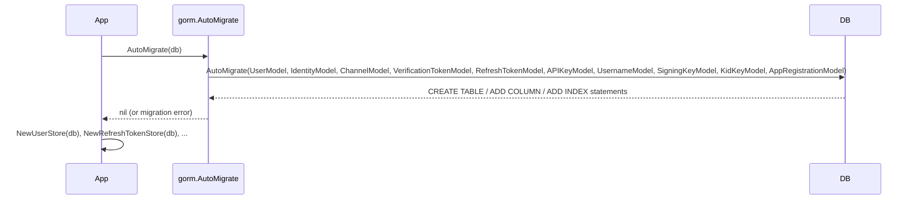
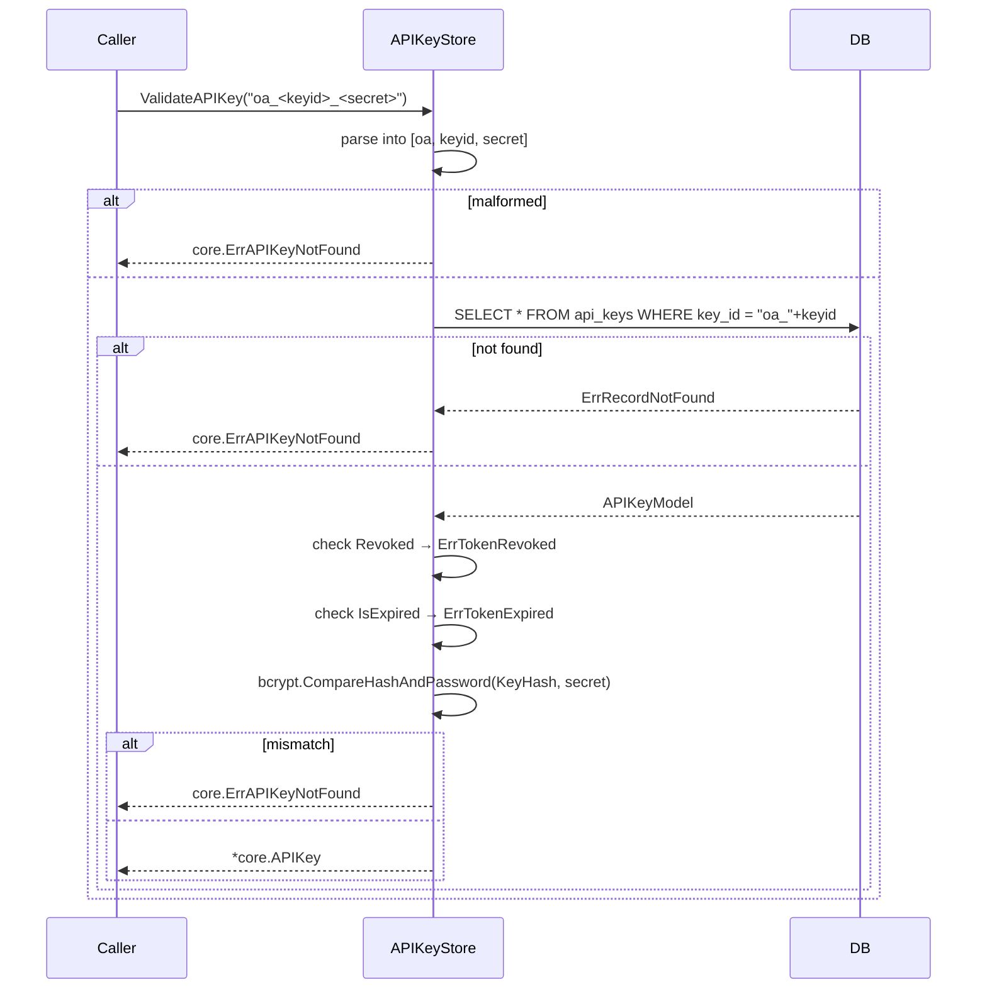
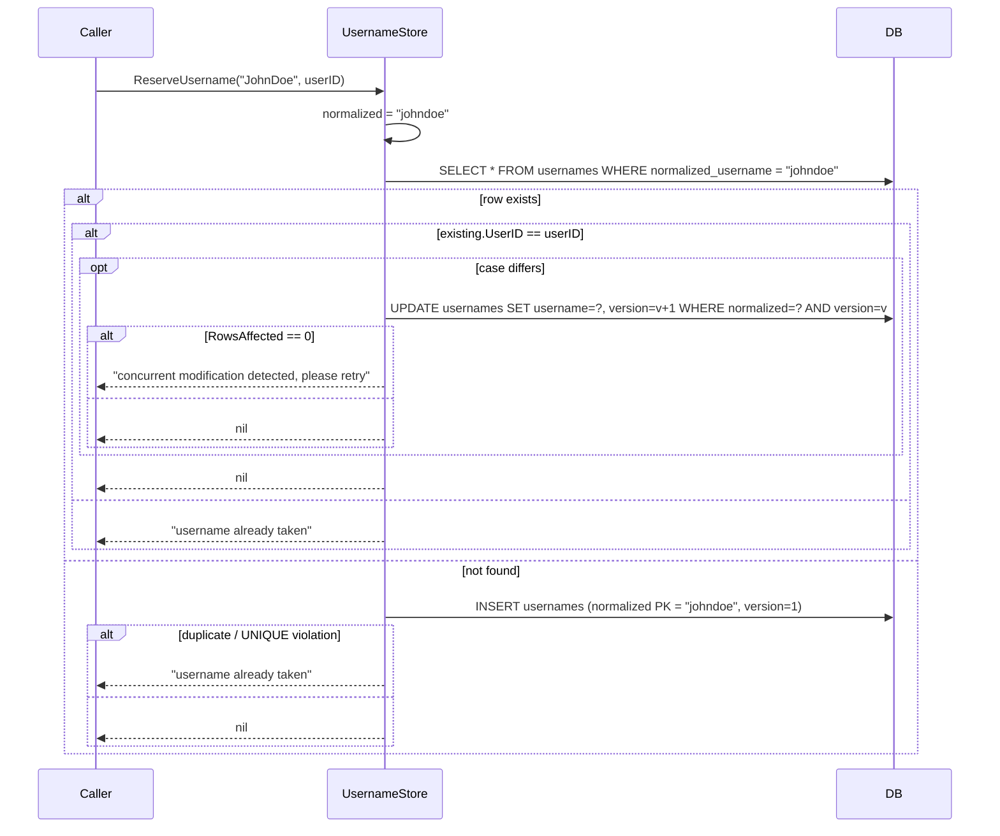
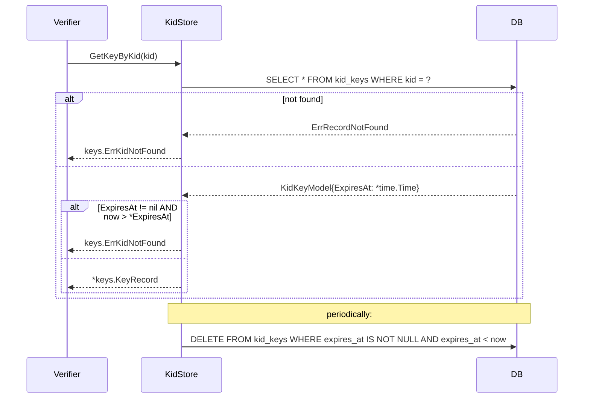

# gorm

GORM/SQL-backed implementations of every oneauth store interface — users, identities, channels, verification tokens, refresh tokens, API keys, usernames, signing keys, kid keys, and app registrations — designed to be portable across SQLite, MySQL, and Postgres via a single `AutoMigrate` entrypoint. This is a separate Go sub-module so consumers who don't need a relational backend don't drag in `gorm.io/gorm`, and every file is gated on `!wasm` because GORM's database/sql drivers don't compile to WebAssembly.

Three design moves keep the surface portable: (1) JSON columns are encoded via custom `driver.Valuer`/`Scanner` types (`JSONMap`, `StringSlice`, `AuthorizationDetailsJSON`) rather than DB-specific JSONB helpers, so the same schema works on SQLite for tests and Postgres for production; (2) refresh tokens are persisted hash-only with the raw value held in memory (`gorm:"-"` on the `Token` field) and rotation runs inside `db.Transaction` for atomic revoke-old + create-new; (3) the username store uses optimistic concurrency (`Version` column + `WHERE version = ?` updates) layered on top of the primary-key uniqueness constraint, so two backends cooperate to detect both insert races and update races.

## Contents

- [Entities](#entities)
- [Flows](#flows)
  - [AutoMigrate startup](#automigrate-startup)
  - [Refresh-token rotation under transaction](#refresh-token-rotation-under-transaction)
  - [API-key validation](#api-key-validation)
  - [Username reservation with optimistic concurrency](#username-reservation-with-optimistic-concurrency)
  - [Kid grace lookup + cleanup](#kid-grace-lookup--cleanup)
- [Gotchas](#gotchas)
- [Depends on](#depends-on)

## Entities

| Entity | Kind | Role | Why |
|---|---|---|---|
| `AutoMigrate` | func | Runs `db.AutoMigrate` for all ten oneauth GORM models in one call. | Single migration entrypoint; callers MUST invoke it (or equivalent SQL migration) before any store is used. |
| `JSONMap` | type | `map[string]any` with `driver.Valuer`/`Scanner` that JSON-encodes into a single column. | Lets profile/credentials/device-info round-trip through `jsonb` portably; `Scan` silently no-ops on non-`[]byte` input. |
| `StringSlice` | type | `[]string` with `Valuer`/`Scanner` that JSON-encodes into one column. | Avoids a join table for scope lists; portable across SQLite/MySQL/Postgres. |
| `AuthorizationDetailsJSON` | type | `[]core.AuthorizationDetail` with `Valuer`/`Scanner` for RFC 9396 details as `jsonb`. | Stores rich authorization details inline on the refresh-token row so rotation copies them by value. |
| `UserModel` | struct | GORM model for the `users` table (`ID`, `IsActive`, `Profile`, `Version`). | `Profile` is JSON-typed; `Version` reserved for future optimistic locking. |
| `IdentityModel` | struct | GORM model for `identities`, keyed by `(Type, Value)` composite PK with `UserID` index. | Composite PK enforces one row per `(type, value)`; `ToIdentity`/`IdentityToModel` bridge to `accounts.Identity`. |
| `ChannelModel` | struct | GORM model for `channels`, keyed by `(Provider, IdentityKey)`; `Credentials`/`Profile` are `JSONMap`. | Composite PK matches the in-memory store; `ExpiresAt` is indexed so channel-auth expiry can be swept. |
| `VerificationTokenModel` | struct | GORM model for email-verification/password-reset tokens, keyed by raw `Token` (table `auth_tokens`). | Short-lived single-use; stored plaintext (unlike refresh tokens) because they expire fast and are one-use. |
| `RefreshTokenModel` | struct | GORM model for refresh tokens, keyed by `TokenHash` with indexed `Family`/`UserID`/`ExpiresAt`/`Revoked`; `Token` is gorm-ignored. | Only the SHA-256 hash is persisted; supports family-wide revocation for reuse detection. |
| `APIKeyModel` | struct | GORM model for API keys, keyed by `KeyID` storing a bcrypt `KeyHash`. | Secret never persisted; bcrypt hash validated at lookup time; `ExpiresAt` nullable for non-expiring keys. |
| `UsernameModel` | struct | GORM model mapping `NormalizedUsername` (lowercase PK) to `UserID` with a `Version` column. | Lowercase normalized PK gives case-insensitive uniqueness via the DB constraint; original-case copy retained for display. |
| `SigningKeyModel` | struct | GORM model for per-client signing keys, keyed by `ClientID` with a unique `Kid` index. | Stores symmetric/asymmetric key bytes + algorithm + kid; unique kid index supports JWKS lookup. |
| `KidKeyModel` | struct | GORM model for the kid grace cache, keyed by `Kid` with a nullable `ExpiresAt`. | Nullable expiry avoids the messy `0001-01-01` zero-date some SQL dialects produce; matches in-memory `KidStore` contract. |
| `AppRegistrationModel` | struct | GORM model for app registrations (RFC 7591/7592) including registration access token + management URI. | Slice fields use `serializer:json` so it works identically across SQLite/MySQL/Postgres without DB-specific JSONB quirks. |
| `GORMUser` | struct | Thin wrapper around `UserModel` that satisfies `accounts.User` (`Id`, `Profile`). | Keeps `accounts.User` interface-only; GORM model stays a pure persistence struct. |
| `UserStore` | struct | `accounts.UserStore` over GORM. | `CreateUser`/`GetUserById`/`SaveUser`; returns `"user not found: <id>"` on miss. |
| `IdentityStore` | struct | `accounts.IdentityStore` over GORM with optional create-on-miss. | `GetIdentity(createIfMissing=true)` is the upsert path used during signup/OAuth callback. |
| `ChannelStore` | struct | `accounts.ChannelStore` over GORM with create-on-miss for new provider/identity pairs. | Mirrors `IdentityStore` semantics for the `(provider, identity_key)` authentication channel. |
| `TokenStore` | struct | `core.TokenStore` for short-lived verification/reset tokens. | `GetToken` auto-deletes expired rows on read (best-effort cleanup without a sweeper). |
| `RefreshTokenStore` | struct | `core.RefreshTokenStore` over GORM with SHA-256 hashing and transactional rotation. | Tokens stored hash-only; rotate/revoke/family-revoke support RFC 6749 reuse detection. |
| `APIKeyStore` | struct | `core.APIKeyStore` over GORM; mints `oa_<keyid>_<secret>`, stores bcrypt hash. | bcrypt-at-rest plus plaintext key never persisted; `ValidateAPIKey` checks revoked/expired before bcrypt. |
| `UsernameStore` | struct | `accounts.UsernameStore` over GORM with optimistic-concurrency Reserve/Change/Release/Get. | Uses `Version` + `WHERE version = ?` updates plus PK uniqueness; `ChangeUsername` best-effort restores the old row on race. |
| `KeyStore` | struct | `keys.KeyStorage` over GORM (`PutKey`/`DeleteKey`/`GetKey`/`GetKeyByKid`/`ListKeyIDs`) with backward-compat aliases. | `ComputeKid` is called automatically if the caller does not supply a kid; unique kid index enforced at the DB. |
| `KidStore` | struct | `keys.KidStorage` over GORM (`Add` upsert, `Remove` idempotent, `GetKeyByKid` filters expired, `CleanExpired`). | `GetKey` always returns `ErrKeyNotFound` because `KidStorage` is kid-indexed (not client-indexed) by design. |
| `AppStore` | struct | `admin.AppRegistrationStore` over GORM (`SaveApp`/`GetApp`/`ListApps`/`DeleteApp`). | Multi-node compatible (DB is source-of-truth); `DeleteApp` returns `admin.ErrAppNotFound` on zero rows affected. |
| `errClientIDRequired` | var | Sentinel error returned by `AppStore.SaveApp` when `ClientID` is empty. | Wording matches `InMemoryAppStore` so the shared appstoretest contract suite passes uniformly across backends. |

## Flows

### AutoMigrate startup



### Refresh-token rotation under transaction

```mermaid
sequenceDiagram
    participant Client
    participant RefreshTokenStore
    participant DB
    Client->>RefreshTokenStore: RotateRefreshToken(oldToken)
    RefreshTokenStore->>RefreshTokenStore: oldHash = sha256(oldToken)
    RefreshTokenStore->>DB: BEGIN
    RefreshTokenStore->>DB: SELECT * FROM refresh_tokens WHERE token_hash = oldHash
    alt not found
        DB-->>RefreshTokenStore: ErrRecordNotFound
        RefreshTokenStore->>DB: ROLLBACK
        RefreshTokenStore-->>Client: core.ErrTokenNotFound
    else revoked
        RefreshTokenStore->>DB: ROLLBACK
        RefreshTokenStore-->>Client: core.ErrTokenReused
    else expired
        RefreshTokenStore->>DB: ROLLBACK
        RefreshTokenStore-->>Client: core.ErrTokenExpired
    else ok
        RefreshTokenStore->>DB: UPDATE refresh_tokens SET revoked=true, revoked_at=now WHERE token_hash=oldHash
        RefreshTokenStore->>RefreshTokenStore: newToken = GenerateSecureToken()
        RefreshTokenStore->>DB: INSERT refresh_tokens (hash, family=same, generation=old+1, ...)
        RefreshTokenStore->>DB: COMMIT
        RefreshTokenStore-->>Client: newRefreshToken (Token = raw value; hash on disk)
    end
```

### API-key validation



### Username reservation with optimistic concurrency



### Kid grace lookup + cleanup



## Gotchas

- **AutoMigrate is mandatory but not automatic.** `NewXStore(db)` constructors do *not* run migrations. Callers must invoke `gorm.AutoMigrate(db)` (or an equivalent SQL migration) once at startup; otherwise the first store call fails with a missing-table error. This is intentional — production deployments often own their own migration tooling — but easy to forget in tests.
- **Refresh tokens are stored hash-only; raw `Token` lives in memory.** `RefreshTokenModel.Token` carries `gorm:"-"`, so reading a row never gives you the raw token back. `RotateRefreshToken` / `CreateRefreshToken` explicitly re-set `rt.Token = newTokenValue` before returning. Code that re-loads a refresh token from the DB and tries to use `.Token` will get an empty string. `GetUserTokens` deliberately blanks `Token` for the same reason.
- **Rotation runs in a single SQL transaction.** `RotateRefreshToken` wraps the select-old / revoke-old / insert-new sequence in `db.Transaction(...)`. This is what makes RFC 6749 §10.4 reuse detection safe under concurrent rotation attempts — two attackers presenting the same old token cannot both succeed. Default isolation is whatever the driver provides (read-committed for Postgres/MySQL, serializable for SQLite); the row-level lock on the old token's primary key is what actually prevents double-rotation.
- **JSON columns on SQLite vs Postgres.** `JSONMap` / `StringSlice` / `AuthorizationDetailsJSON` all carry the GORM tag `type:jsonb`. On Postgres that's a real JSONB type; on SQLite it degrades to TEXT (SQLite ignores unknown types). The custom `Value()`/`Scan()` methods do the JSON marshalling themselves, so the column-type tag is mostly a hint for Postgres — the round-trip works on either backend. `AppRegistrationModel` takes a different route (`serializer:json`) — that's GORM's built-in serializer, picked specifically to dodge JSONB quirks. Both work; don't mix them on a single column.
- **`Scan` silently no-ops on non-`[]byte` input.** All three JSON helper types return `nil` (not an error) if the driver hands back something other than `[]byte`. This is forgiving for nullable columns but will mask real bugs if a driver returns `string` (which `pgx` sometimes does in v5 — `database/sql` mode generally returns `[]byte`, so this matches GORM's path).
- **Verification tokens stored plaintext; refresh tokens hashed.** `VerificationTokenModel` keys on the raw `Token` because these are short-lived (minutes), single-use (deleted on consume), and only useful out-of-band over a side channel (email). Refresh tokens are long-lived bearer credentials, so they're hashed. If a future verification flow needs a long-lived token, hash it too.
- **`TokenStore.GetToken` mutates on read.** When a verification token is expired, `GetToken` calls `DeleteToken` before returning `"token expired"`. This is a best-effort cleanup — failures are ignored (`_ = ...`). Don't rely on it; use `CleanupExpiredTokens` (on the refresh token store) or a real sweeper if you need guarantees.
- **`CleanupExpiredTokens` keeps revoked rows 24h.** On the refresh-token store it deletes `expires_at < now OR (revoked = true AND revoked_at < now-24h)`. So revoked tokens are kept for a 24-hour audit window — useful for detecting "the attacker presented a token I already rotated out" for a day after rotation.
- **API-key parser is hand-rolled and lenient.** `ValidateAPIKey` does not use `strings.Split`; it walks the input char-by-char and stops counting after three `_`. The format is strictly `oa_<keyid>_<secret>` — anything else returns `ErrAPIKeyNotFound`. Underscores inside the secret portion are fine; underscores inside the keyid portion would silently shift the split.
- **bcrypt cost is `bcrypt.DefaultCost`** (currently 10). For high-throughput API-key validation, this is the bottleneck — bcrypt is intentionally slow. If you need faster validation, cache the validated key in process memory by `keyID` and re-check bcrypt only on cache miss.
- **`UsernameStore` uses two concurrency mechanisms together.** The PK uniqueness on `normalized_username` catches insert races (two new reservations of the same name); the `Version` column + `WHERE version = ?` updates catch update races (two profile updates against the same row). Don't drop either — they cover different cases. `ChangeUsername` does a best-effort restore of the old row if the new one races a third party (`s.db.Create(&oldModel)`); this is not transactional, so a worst-case interleaving can leave the user temporarily without a reservation.
- **Username `Version` increments are not atomic across read+update.** `ReserveUsername`/`ChangeUsername` read the version then update with `WHERE version = ?`. If two processes read `v=3` simultaneously, one will succeed (`v=4`) and the other gets `RowsAffected == 0` → "concurrent modification detected, please retry." Callers must retry; the store does not.
- **Duplicate-key detection by error string.** `ReserveUsername` does `strings.Contains(err.Error(), "duplicate") || strings.Contains(err.Error(), "UNIQUE")` to translate PK violations into `"username already taken"`. This is dialect-specific — Postgres says `"duplicate key value"`, SQLite says `"UNIQUE constraint failed"`, MySQL says `"Duplicate entry"`. The current substrings cover all three but any new driver may need an additional case.
- **`KidKeyModel.ExpiresAt` is `*time.Time`, not `time.Time`.** Deliberate — a zero `time.Time` serializes to `0001-01-01 00:00:00` in some SQL dialects, which is awkward for "never expires" semantics. Nullable column + `nil` pointer is cleaner. `Add()` only writes the pointer when `!expiresAt.IsZero()`.
- **`KidStore.GetKey(clientID)` always returns `ErrKeyNotFound`.** Not a bug. `KidStorage` is indexed by kid, not by client; the method exists to satisfy the interface but has no useful answer to give. Callers should use `GetKeyByKid`.
- **`KidStore.GetKeyByKid` filters expired rows but doesn't delete them.** Expired entries return `ErrKidNotFound` on read; physical deletion is `CleanExpired`'s job. Run it periodically (e.g., a janitor goroutine) or expired rows accumulate.
- **`SigningKeyModel.Kid` has a unique index (`idx_kid,unique`).** Two clients cannot share the same `kid`. If `PutKey` is called without a `Kid`, `utils.ComputeKid` is invoked to derive one — if two clients happen to produce the same derived kid (unlikely for asymmetric keys, possible for shared HS256 secrets), the second `PutKey` fails with a unique-constraint violation.
- **`AppRegistrationModel` uses GORM's `serializer:json`, not the custom `StringSlice`.** This is the newer GORM pattern (≥ v1.25) and is preferred for fresh models. `serializer:json` handles `nil` correctly and emits SQL `NULL` rather than the string `"null"`. Don't migrate the older models (`RefreshTokenModel.Scopes`, etc.) without a data migration — the on-disk representations differ in the `NULL`-vs-empty-array case.
- **`AppStore` returns a sentinel `*appStoreError`, not `errors.New`.** The wording (`"AppRegistration.ClientID required"`) is the contract — the shared appstoretest suite asserts on it. Don't change the message.
- **Build tag `!wasm`.** Every file in this package is gated on `!wasm`, because GORM's SQL drivers won't compile to wasm. Consumers building for wasm must avoid importing this package; use the FS store or in-memory store instead.
- **Sub-module isolation.** `stores/gorm/` has its own `go.mod` precisely so `gorm.io/gorm` and the driver dependencies stay out of the main module. Consumers who don't need a relational backend pay nothing for GORM. Local development uses `replace` directives in `go.work`; releases are tagged in lock-step via `make tag V=...`.

## Depends on

- [`../../accounts/DESIGN.md`](../../accounts/DESIGN.md) — `accounts.User` / `accounts.Identity` / `accounts.Channel` are the bridge types `GORMUser`, `IdentityModel`, `ChannelModel`, `UserModel` convert to/from; `UserStore`, `IdentityStore`, `ChannelStore`, and `UsernameStore` implement the matching `accounts.*Store` interfaces.
- [`../../admin/DESIGN.md`](../../admin/DESIGN.md) — `AppStore` implements `admin.AppRegistrationStore`, persists `admin.AppRegistration`, and returns `admin.ErrAppNotFound` on `GetApp`/`DeleteApp` misses.
- [`../../appstoretest/DESIGN.md`](../../appstoretest/DESIGN.md) — `appstore_test.go` calls `appstoretest.RunAll` with a factory that produces a GORM `AppStore` typed as `admin.AppRegistrationStore`, running the shared contract suite.
- [`../../core/DESIGN.md`](../../core/DESIGN.md) — `RefreshTokenStore` and `APIKeyStore` persist `core.RefreshToken` / `core.APIKey`, mint via `core.GenerateSecureToken` / `core.GenerateAPIKeyID` / `core.GenerateAPIKeySecret`, use `core.TokenExpiryRefreshToken` for default TTL, embed `AuthorizationDetailsJSON` (`[]core.AuthorizationDetail`) for RFC 9396 details, and surface the `core.Err{TokenNotFound, TokenReused, TokenExpired, TokenRevoked, APIKeyNotFound}` sentinels.
- [`../../keys/DESIGN.md`](../../keys/DESIGN.md) — `KeyStore` implements `keys.KeyStorage` and `KidStore` implements `keys.KidStorage` over `keys.KeyRecord`; misses return `keys.ErrKeyNotFound` / `keys.ErrKidNotFound`, algorithm mismatches return `keys.ErrAlgorithmMismatch`.
- [`../../keystoretest/DESIGN.md`](../../keystoretest/DESIGN.md) — `keystore_test.go` calls `keystoretest.RunAll` with a factory that yields a `keys.KeyStorage`-shaped GORM `KeyStore`, running the shared KeyStorage contract.
- [`../../kidstoretest/DESIGN.md`](../../kidstoretest/DESIGN.md) — `kidstore_test.go` calls `kidstoretest.RunAll` with a factory that yields a `keys.KidStorage`-shaped GORM `KidStore`, running the shared KidStorage contract.
- [`../../localauth/DESIGN.md`](../../localauth/DESIGN.md) — `TokenStore` persists `localauth.VerificationToken` keyed by raw token and tagged with `localauth.VerificationType` (`email_verification` / `password_reset`); `VerificationTokenModel` round-trips to/from the localauth struct.
- [`../../utils/DESIGN.md`](../../utils/DESIGN.md) — `KeyStore.PutKey` invokes `utils.ComputeKid(keyBytes, algorithm)` to derive a deterministic `kid` whenever the caller does not supply one.
