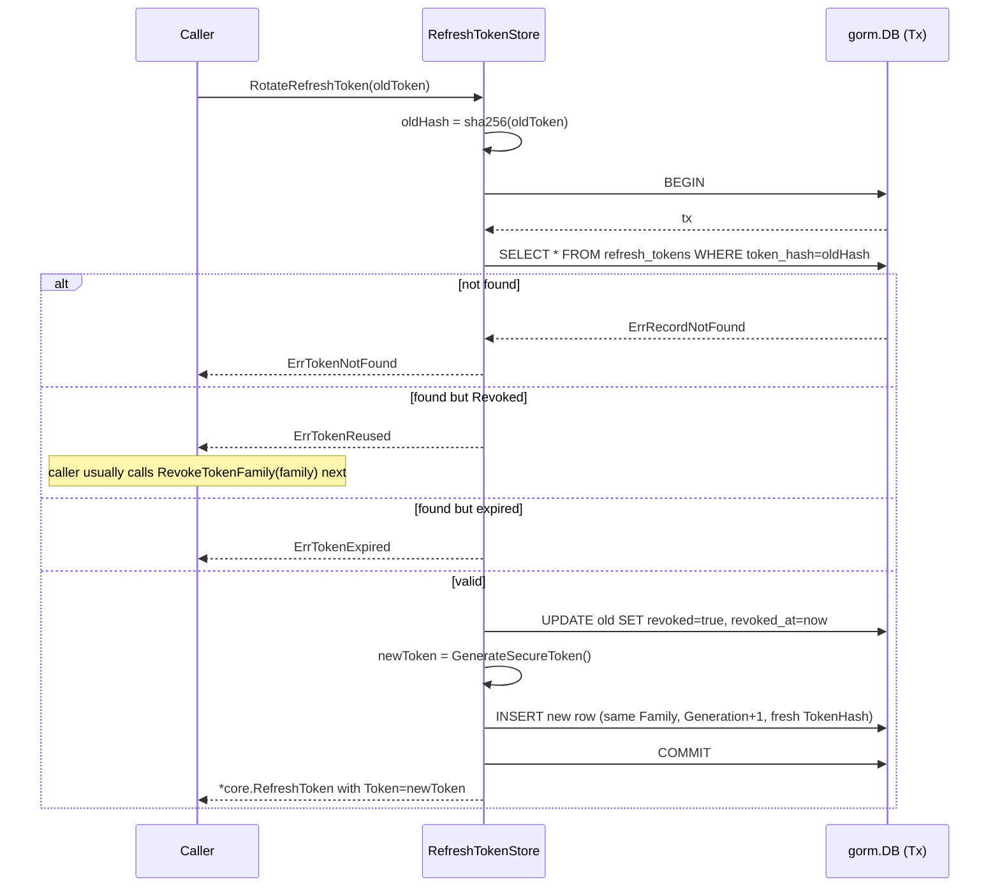
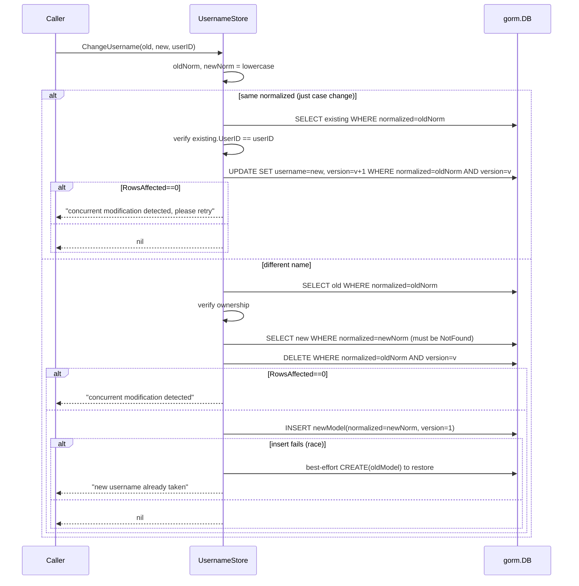

# gorm

GORM/SQL-backed implementations of every oneauth store interface — users, identities, channels, verification/reset tokens, refresh tokens, API keys, usernames, per-client signing keys, kid grace entries, and app registrations. A single `AutoMigrate` provisions all ten tables on any GORM-supported driver (SQLite, MySQL, Postgres). Lives in its own Go sub-module so apps that don't want GORM in their dependency graph can skip it; the module has a `!wasm` build tag throughout because GORM's database/sql drivers don't compile to WebAssembly.

## Contents

- [Entities](#entities)
- [Flows](#flows)
- [Gotchas](#gotchas)
- [Depends on](#depends-on)

## Entities

| Entity | Kind | Role | Why |
|---|---|---|---|
| `AutoMigrate` | func | Runs `db.AutoMigrate` for all ten oneauth GORM models in one call. | Single migration entrypoint; callers MUST run it (or equivalent) before any store is used. |
| `JSONMap` | type | `map[string]any` with `driver.Valuer`/`Scanner` that JSON-encodes into a single column. | Custom Value/Scan so jsonb columns round-trip portably; Scan silently no-ops on non-`[]byte` input. |
| `StringSlice` | type | `[]string` with Valuer/Scanner that JSON-encodes into one column. | Avoids a join table for scope lists; portable across SQLite/MySQL/Postgres. |
| `AuthorizationDetailsJSON` | type | `[]core.AuthorizationDetail` with Valuer/Scanner for RFC 9396 details as jsonb. | Stores rich authorization details inline on the refresh token row. |
| `UserModel` | struct | GORM model for the `users` table (ID, IsActive, Profile, Version). | Profile uses `JSONMap`; Version present for future optimistic locking. |
| `IdentityModel` | struct | GORM model for `identities`, keyed by (Type, Value) composite primary key. | Composite PK enforces one row per type+value; `ToIdentity`/`IdentityToModel` bridge to `core.Identity`. |
| `ChannelModel` | struct | GORM model for `channels`, keyed by (Provider, IdentityKey). | Credentials and Profile are `JSONMap`; `ExpiresAt` tracks channel-auth expiry. |
| `AuthTokenModel` | struct | GORM model for `auth_tokens` (verification/reset), keyed by raw Token. | Token is the primary key in plaintext — these are short-lived single-use tokens, unlike refresh tokens. |
| `RefreshTokenModel` | struct | GORM model for `refresh_tokens`, keyed by TokenHash; Token field is gorm-ignored. | Only the SHA-256 hash is persisted; raw Token (`gorm:"-"`) lives in memory only. |
| `APIKeyModel` | struct | GORM model for `api_keys`, keyed by KeyID, storing a bcrypt KeyHash. | Secret is never stored; only the bcrypt hash, validated at lookup time. |
| `UsernameModel` | struct | GORM model mapping NormalizedUsername (PK) to UserID with a Version column. | Lowercase normalized PK gives case-insensitive uniqueness; Version drives optimistic concurrency. |
| `SigningKeyModel` | struct | GORM model for `signing_keys` (per-client), keyed by ClientID with a unique Kid index. | Kid computed via `utils.ComputeKid` when absent. |
| `KidKeyModel` | struct | GORM model for `kid_keys` (kid->key grace entries), keyed by Kid with nullable ExpiresAt. | `ExpiresAt` is `*time.Time` so nil means "never expires", dodging SQL `0001-01-01` zero-date quirks. |
| `AppRegistrationModel` | struct | GORM model for `app_registrations` (RFC 7591/7592 + RFC 9396 fields). | Slice fields use `gorm:"serializer:json"` to avoid DB-specific JSONB quirks; persists RFC 7592 management credentials across restarts. |
| `GORMUser` | struct | `core.User` adapter wrapping a `*UserModel`. | Exposes `Id()`/`Profile()` without leaking the GORM model to callers. |
| `UserStore` | struct | `core.UserStore` impl (`CreateUser`, `GetUserById`, `SaveUser`). | `GetUserById` maps `gorm.ErrRecordNotFound` to a descriptive error. |
| `NewUserStore` | func | Constructs a `UserStore` over an existing `*gorm.DB`. | All constructors take `*gorm.DB` so the caller controls connection pool, dialect, and migrations. |
| `IdentityStore` | struct | `core.IdentityStore` impl with get-or-create, verify, and user-reassign. | `GetIdentity` optionally inserts a placeholder (empty UserID) row when `createIfMissing`. |
| `NewIdentityStore` | func | Constructs an `IdentityStore` over an existing `*gorm.DB`. | Identity reads/writes share the same dialect-agnostic GORM handle. |
| `ChannelStore` | struct | `core.ChannelStore` impl with get-or-create by (provider, identityKey). | Initializes empty `JSONMap`s on creation to avoid nil-map writes. |
| `NewChannelStore` | func | Constructs a `ChannelStore` over an existing `*gorm.DB`. | Keeps channel persistence in lock-step with the rest of the GORM stores. |
| `TokenStore` | struct | `core.TokenStore` impl for verification/reset tokens. | `GetToken` lazily deletes the row when expired, returning "token expired". |
| `NewTokenStore` | func | Constructs a `TokenStore` over an existing `*gorm.DB`. | Same DB handle is shared with the rest of the auth-flow stores. |
| `RefreshTokenStore` | struct | `core.RefreshTokenStore` impl with rotation, family/user revoke, cleanup. | Hashes tokens with SHA-256; `RotateRefreshToken` runs inside a transaction with reuse detection. |
| `NewRefreshTokenStore` | func | Constructs a `RefreshTokenStore` over an existing `*gorm.DB`. | Rotation requires transactions, so the caller's DB driver must support them. |
| `RefreshTokenStore.RotateRefreshToken` | method | Transactionally revokes the old refresh token and issues the next-generation token in the same family. | Detects reuse (Revoked-on-rotate) and enforces expiry inside one Tx so two parallel rotations can't both succeed. |
| `RefreshTokenStore.RevokeTokenFamily` | method | Bulk-revokes every non-revoked token sharing a Family value. | Family is the rotation-chain identifier; revoking the family kills the whole device after a reuse detection. |
| `RefreshTokenStore.CleanupExpiredTokens` | method | Deletes rows whose `expires_at` has passed or that were revoked >24h ago. | Two-stage cleanup keeps revoked rows around briefly so audits/reuse-detection can still see them. |
| `APIKeyStore` | struct | `core.APIKeyStore` impl issuing `oa_<keyid>_<secret>` keys with bcrypt validation. | `ValidateAPIKey` hand-parses the three-part key and bcrypt-compares; never returns the hash to callers. |
| `NewAPIKeyStore` | func | Constructs an `APIKeyStore` over an existing `*gorm.DB`. | Same DB handle so `AutoMigrate` provisions the `api_keys` table alongside the rest. |
| `APIKeyStore.ValidateAPIKey` | method | Splits `oa_<keyid>_<secret>`, looks up the row by keyID, and bcrypt-compares the secret. | Constant-prefix split (`oa_`) and bcrypt comparison resist trivial enumeration; revoked/expired keys short-circuit before bcrypt. |
| `UsernameStore` | struct | `core.UsernameStore` impl with optimistic-concurrency reserve/change/release. | Uses `WHERE version=?` guards and `RowsAffected==0` to detect concurrent edits; best-effort rollback in `ChangeUsername`. |
| `NewUsernameStore` | func | Constructs a `UsernameStore` over an existing `*gorm.DB`. | Optional store — only configured when `SignupPolicy` requires usernames. |
| `UsernameStore.ReserveUsername` | method | Atomically claims a normalized username for a user, deduping on PK uniqueness. | Relies on the DB unique constraint so concurrent inserts at the same normalized name fail loudly. |
| `UsernameStore.ChangeUsername` | method | Atomically swaps `oldUsername` to `newUsername` for `userID` with version-checked delete + insert. | Same-normalized cases short-circuit to a case rewrite; cross-name swaps best-effort restore the old row if the new insert races. |
| `KeyStore` | struct | `keys.KeyStorage` impl (`PutKey`, `GetKey`, `GetKeyByKid`, `ListKeyIDs`) plus legacy aliases. | Backward-compat aliases (`RegisterKey`/`GetVerifyKey`/etc.) delegate to the canonical methods. |
| `NewKeyStore` | func | Constructs a `KeyStore` over an existing `*gorm.DB`. | Same migrate-once pattern; `signing_keys` table is created by `AutoMigrate`. |
| `KidStore` | struct | `keys.KidStorage` impl (`Add` upsert, `Remove`, `GetKeyByKid`, `CleanExpired`). | `GetKey` always returns `ErrKeyNotFound` (kid-indexed only); reads filter expired entries to match in-memory semantics. |
| `NewKidStore` | func | Constructs a `KidStore` over an existing `*gorm.DB`. | Persists the kid grace ring so multi-node rotation survives restarts. |
| `AppStore` | struct | `admin.AppRegistrationStore` impl (`SaveApp`, `GetApp`, `ListApps`, `DeleteApp`). | Error semantics (`ErrAppNotFound`, ClientID-required) mirror `InMemoryAppStore` so the shared contract suite passes uniformly. |
| `NewAppStore` | func | Constructs an `AppStore` over an existing `*gorm.DB`. | Production-grade backend for the DCR persistence chain; multi-node-safe because the DB is the source of truth. |

## Flows

### Refresh token rotation with family-based reuse detection

### Username change with optimistic concurrency

## Gotchas

- **Sub-module + build tag** — `stores/gorm` has its own `go.mod` and every file carries `//go:build !wasm`. Apps that compile to wasm or want to skip the GORM dependency graph simply don't import it; the parent `oneauth` module never depends on it directly.
- **`AutoMigrate` is non-optional** — every constructor assumes the table exists. Forgetting to call `AutoMigrate(db)` (or running an equivalent migration) before the first store call surfaces as obscure SQL "no such table" errors rather than a friendly setup message.
- **Refresh tokens store only the hash** — `RefreshTokenModel.Token` is tagged `gorm:"-"`; only `TokenHash` (SHA-256 hex) is persisted. Callers must capture the raw token returned from `CreateRefreshToken`/`RotateRefreshToken` immediately — later `GetUserTokens` calls explicitly blank the token field.
- **Family-based reuse detection is the caller's job** — `RotateRefreshToken` returns `ErrTokenReused` if the old token is already revoked, but it does NOT auto-revoke the family. Higher layers must call `RevokeTokenFamily(family)` on detection, otherwise compromised tokens stay valid until expiry.
- **`CleanupExpiredTokens` is two-staged** — expired rows are deleted immediately, but revoked rows linger for 24 hours after revocation so reuse-detection has a window to fire. Set up a periodic job to call it.
- **API key format is rigid** — the secret format is `oa_<keyid>_<secret>` and `ValidateAPIKey` hand-parses it (no `strings.SplitN` because keyID is itself `oa_<random>`). Changing the prefix or separator breaks every issued key.
- **Optimistic concurrency on usernames is best-effort** — `ChangeUsername` does delete-then-insert with `WHERE version=?` guards, and on insert race it tries to recreate the old row. There's a tiny window where a crash between delete and recreate leaves the user without a reservation; treat it as eventually-consistent UX, not a hard guarantee.
- **`UsernameStore.ReserveUsername` string-matches DB errors** — it greps for `"duplicate"` or `"UNIQUE"` in the error text to map race losers to `"username already taken"`. Less-common drivers may return errors that don't match and surface as raw SQL errors.
- **JSON column types use `jsonb` tag** — `JSONMap`/`StringSlice`/`AuthorizationDetailsJSON` declare `gorm:"type:jsonb"` (Postgres-flavoured). SQLite happily stores anything; MySQL treats `jsonb` as `JSON`. The newer `AppRegistrationModel` uses `gorm:"serializer:json"` instead, which is fully portable — that's the preferred pattern going forward.
- **`KidKeyModel.ExpiresAt` is `*time.Time`** — using a nullable pointer dodges SQL `0001-01-01` zero-date quirks that some dialects produce when you store a zero `time.Time`. Nil means "never expires", matching the in-memory `KidStore` semantics.
- **`KidStore.GetKey(clientID)` is intentionally stubbed** — `KidStorage` is kid-indexed only, so `GetKey` always returns `ErrKeyNotFound`. Use `GetKeyByKid` instead.
- **`KeyStore.GetKey` requires `[]byte` keys** — `PutKey`/`Add` both type-assert `rec.Key.([]byte)` and return `ErrAlgorithmMismatch` on failure. PEM/DER serialization is the caller's responsibility before persistence.
- **`AppStore` mirrors `InMemoryAppStore` error semantics** — same `ErrAppNotFound`, same "ClientID required" message (via the unexported `appStoreError`). This lets the shared `appstoretest` contract suite run uniformly across both backends.
- **No GORM auto-`DeletedAt` soft-delete** — none of the models embed `gorm.Model` or declare a `DeletedAt` column. Deletes are hard. The "revoked" flag on tokens is a logical-revoke pattern, not a GORM soft-delete.

## Depends on

- [`admin/`](../../admin/DESIGN.md) — `AppRegistration`, `AppRegistrationStore`, `ErrAppNotFound`
- [`core/`](../../core/DESIGN.md) — `APIKey`, `APIKeyStore`, `AuthorizationDetail`, `AuthToken`, `Channel`, `ChannelStore`, `ErrAPIKeyNotFound`, `ErrTokenExpired`, `ErrTokenNotFound`, `ErrTokenReused`, `ErrTokenRevoked`, `GenerateAPIKeyID`, `GenerateAPIKeySecret`, `GenerateSecureToken`, `Identity`, `IdentityStore`, `RefreshToken`, `RefreshTokenStore`, `TokenExpiryRefreshToken`, `TokenStore`, `TokenType`, `User`, `UsernameStore`, `UserStore`
- [`keys/`](../../keys/DESIGN.md) — `ErrAlgorithmMismatch`, `ErrKeyNotFound`, `ErrKidNotFound`, `KeyRecord`, `KeyStorage`, `KidStorage`
- [`utils/`](../../utils/DESIGN.md) — `ComputeKid`
