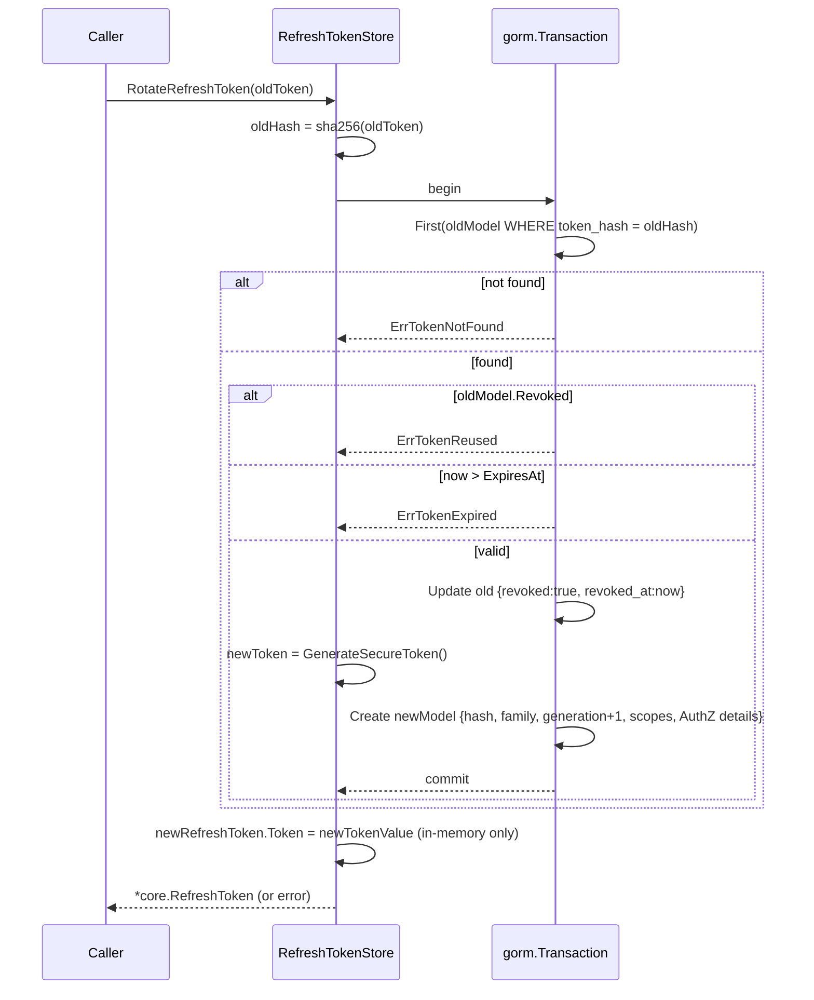
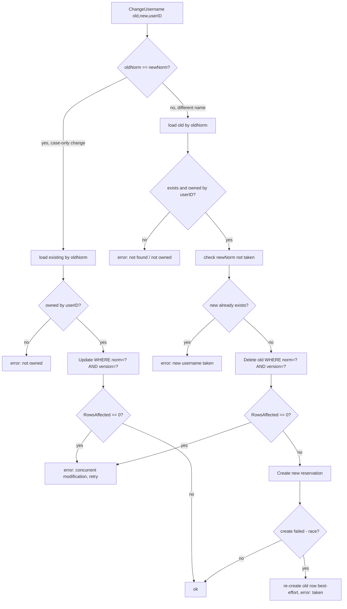

# gorm — Flows

## Refresh token rotation (`RefreshTokenStore.RotateRefreshToken`)

A single DB transaction trades an old refresh token for a new one in the same
family, detecting reuse and expiry before issuing. The raw token value is
returned only in memory; only its SHA-256 hash is persisted.

Notable: the new token inherits `Family`, `Scopes`, and `AuthorizationDetails`
from the old one and increments `Generation`; revoke-then-create is atomic so a
crash mid-rotation cannot leave two live tokens.

## Username change (`UsernameStore.ChangeUsername`)

Cross-record optimistic concurrency. When the normalized form is unchanged it is
a single versioned update; when it differs it is a delete-then-create across two
rows, guarded by version checks, with best-effort rollback if the new name was
taken in a race.

Notable: there is no enclosing transaction across the delete+create — the
version guards plus the best-effort restore in the race branch are what protect
consistency. `ReserveUsername` follows the same version-guarded pattern for the
initial reservation.
