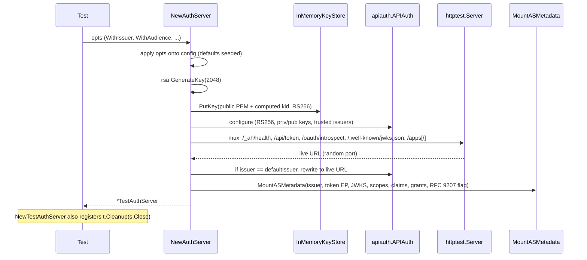
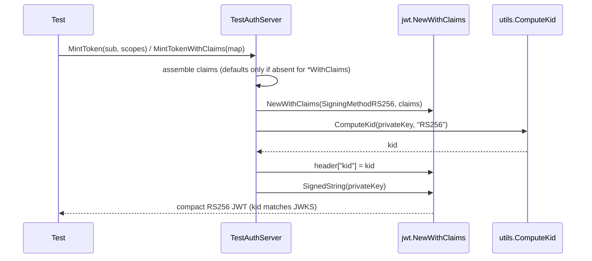

# testutil

Shared test setup helpers used across oneauth's package test suites. Centerpiece is `TestAuthServer`, an in-process `httptest.Server` wired to a fresh RSA 2048 key pair that serves JWKS, AS metadata (RFC 8414), token (`client_credentials` and — when configured — `jwt-bearer` / `token-exchange`), introspection (RFC 7662), and app-registration (RFC 7591) endpoints. Alongside the server, the package exposes lightweight, `t.Fatal`-on-error helpers that fetch discovery documents, POST grants, parse JWTs, and read JWKS so tests can avoid hand-rolling boilerplate.

## Contents

- [Entities](#entities)
- [Flows](#flows)
  - [Starting an in-process AS](#starting-an-in-process-as)
  - [Minting a JWT](#minting-a-jwt)
- [Gotchas](#gotchas)
- [Depends on](#depends-on)

## Entities

| Entity | Kind | Role | Why |
|---|---|---|---|
| `TestAuthServer` | struct | In-process httptest-backed OAuth AS with RSA keys, JWKS, token, introspection, AS metadata, and app registration endpoints. | Centerpiece of the package; gives downstream test suites a real oneauth stack on a random port. |
| `NewTestAuthServer` | func | Builds a `TestAuthServer` bound to `*testing.T` with automatic `t.Cleanup` shutdown. | Preferred entry point for tests; removes the need for manual `Close` calls. |
| `NewAuthServer` | func | Builds a `TestAuthServer` without `*testing.T`; caller must `Close`. | Lets examples, benchmarks, and non-test code reuse the same server. |
| `Option` | type | Functional option type for configuring a `TestAuthServer`. | Keeps `NewAuthServer`'s signature stable as new knobs are added. |
| `WithAdminKey` | func | Sets the admin API key guarding `/apps` endpoints. | Overrides the default `"testutil-admin-key"` when a test asserts a specific key. |
| `WithIssuer` | func | Sets the JWT issuer and AS-metadata issuer. | Default sentinel is replaced with the live server URL after start; override pins a value. |
| `WithAudience` | func | Sets the JWT audience claim on minted tokens. | Empty default leaves tokens unrestricted; tests asserting audience must opt in. |
| `WithScopes` | func | Sets `scopes_supported` in AS metadata (advertisement only). | Lets tests advertise custom scopes without changing server behavior. |
| `WithClaimsSupported` | func | Sets `claims_supported` in AS metadata. | Default lists the claims oneauth tokens actually emit; override only when asserting other claims. |
| `WithGrantTypesSupported` | func | Replaces the advertised `grant_types_supported` list. | Advertising a grant does NOT enable its handler; pair with `WithTrustedAssertionIssuers` to actually serve it. |
| `WithIssParameterSupported` | func | Sets the RFC 9207 iss-parameter flag in AS metadata. | Metadata-only; no authorization endpoint drives the actual behavior yet. |
| `WithTrustedAssertionIssuers` | func | Enables jwt-bearer (RFC 7523) and token-exchange (RFC 8693) grants and auto-extends advertised grants. | Only Option that turns advertisement into real behavior; later `WithGrantTypesSupported` can still override. |
| `TestAuthServer.MintToken` | method | Mints a standard RS256 access JWT directly, bypassing the HTTP token endpoint. | Fast path with no network round-trip; kid header matches JWKS for verification. |
| `TestAuthServer.MintTokenWithClaims` | method | Mints an RS256 JWT from an arbitrary claims map with overridable iss/iat/exp defaults. | Enables negative tests (wrong issuer, expired, missing claims). |
| `TestAuthServer.MintTokenForSubject` | method | Convenience minting for a subject and scopes; no `*testing.T` needed. | Aimed at non-test example code that still wants a signed token. |
| `TestAuthServer.URL` | method | Returns the server base URL. | Only known after the random httptest port binds. |
| `TestAuthServer.JWKSURL` | method | Returns the JWKS endpoint URL. | Lets tests point JWKS-aware clients at the live server. |
| `TestAuthServer.TokenEndpoint` | method | Returns the token endpoint URL. | Lets tests POST grants directly when bypassing discovery. |
| `TestAuthServer.AdminKey` | method | Returns the configured admin API key. | Tests need it to call `/apps` endpoints. |
| `TestAuthServer.Issuer` | method | Returns the resolved JWT issuer. | Reads the server URL when the default sentinel was used. |
| `TestAuthServer.Close` | method | Stops the underlying `httptest` server; nil-safe. | Called automatically via `t.Cleanup` when `NewTestAuthServer` is used. |
| `OIDCConfig` | struct | Parsed OAuth/OIDC AS metadata document (RFC 8414). | Decode target for `DiscoverOIDC` and a typed view onto the discovery doc. |
| `TokenResponse` | struct | Parsed OAuth token endpoint response (RFC 6749 section 5.1). | Common return type for the grant helpers. |
| `DiscoverOIDC` | func | Fetches and parses the `.well-known/openid-configuration` document. | Works against any compliant AS; fails via `t.Fatal` for test ergonomics. |
| `GetClientCredentialsToken` | func | Acquires a token via the `client_credentials` grant (RFC 6749 section 4.4). | Thin wrapper that delegates to `PostTokenEndpoint` with the right form fields. |
| `GetPasswordToken` | func | Acquires a token via the resource owner password grant (RFC 6749 section 4.3). | Test-only helper with no production equivalent. |
| `PostTokenEndpoint` | func | Sends a form POST to a token endpoint and decodes the JSON `TokenResponse`. | Shared core that the grant helpers delegate to; reusable for custom grants. |
| `FetchJWKS` | func | Fetches raw JWKS JSON as an untyped map (RFC 7517). | Lets tests inspect the JWKS without pulling in a JWK library. |
| `ParseJWTClaims` | func | Base64url-decodes a JWT payload without verifying the signature. | Test introspection only; never use in production. |
| `ParseJWTHeader` | func | Base64url-decodes a JWT header without verifying the signature. | Test introspection only; never use in production. |

## Flows

### Starting an in-process AS

`NewAuthServer` / `NewTestAuthServer` wire together several oneauth components; the sequence matters because the issuer URL is only known after the port binds.

### Minting a JWT

## Gotchas

- **Random port** — `httptest.NewServer` binds an ephemeral port; tests must read `URL()` / `JWKSURL()` / `TokenEndpoint()` rather than hard-coding ports.
- **Issuer sentinel rewrite** — with the default `defaultIssuer`, both the metadata `issuer` field and `APIAuth.JWTIssuer` are overwritten with the live server URL after start; pass `WithIssuer` to pin a value.
- **`WithAudience` is opt-in** — with the empty default, minted tokens do not include `aud`; downstream `aud` validation must either set `WithAudience` or accept tokens without it.
- **JWKS only exposes asymmetric keys** — tokens signed with HS256 keys registered via `/apps/register` are NOT verifiable via JWKS. By design, the server itself signs with RS256 and the JWKS handler omits symmetric secrets (`keys/jwks_handler.go`). Tests that validate via JWKS must mint RS256 (or ES256) tokens — use `MintToken` / `MintTokenWithClaims`, not HS256 fixtures.
- **Advertise vs. enable** — `WithGrantTypesSupported` only edits AS metadata. To actually serve `jwt-bearer` (RFC 7523 section 2.1) / `token-exchange` (RFC 8693), configure `WithTrustedAssertionIssuers`, which also auto-extends the advertised list unless a later `WithGrantTypesSupported` replaces it.
- **`WithIssParameterSupported` is metadata-only** — there is no authorization endpoint in the test server yet, so flipping the flag asserts a behavior the server does not currently emit on redirects (RFC 9207 section 2).
- **AS metadata mounting is once-only** — `apiauth.MountASMetadata` is called inside `NewAuthServer` against the mux that backs the live `httptest.Server`. Adding routes to that mux after start works, but re-mounting metadata (or starting two ASes that share a mux) will panic on duplicate path registration.
- **Cleanup discipline** — `NewTestAuthServer` registers `Close` via `t.Cleanup`; callers of `NewAuthServer` must invoke `Close` themselves.
- **`ParseJWTClaims` / `ParseJWTHeader` skip signature verification** — test-only; never call from production code paths.
- **Helpers `t.Fatal` on error** — `DiscoverOIDC`, `PostTokenEndpoint`, `GetClientCredentialsToken`, `GetPasswordToken`, `FetchJWKS`, `ParseJWT*` all abort the test on failure; they are not safe to call from non-test contexts.

## Depends on

- [../admin/DESIGN.md](../admin/DESIGN.md) — `AppRegistrar` plus `NewAppRegistrar` / `NewAPIKeyAuth` to mount the `/apps` registry behind an X-Admin-Key guard.
- [../apiauth/DESIGN.md](../apiauth/DESIGN.md) — `APIAuth` (token endpoint), `TrustedAssertionIssuer` plus `JwtBearerGrantType` / `TokenExchangeGrantType` constants, `NewIntrospectionHandler`, and `MountASMetadata` / `ASServerMetadata` to wire the full AS surface.
- [../core/DESIGN.md](../core/DESIGN.md) — `GenerateSecureToken` for JWT `jti` claim generation in minted tokens.
- [../httpauth/DESIGN.md](../httpauth/DESIGN.md) — `LimitBody` middleware and `DefaultMaxBodySize` wrap the registrar's `/apps` routes.
- [../keys/DESIGN.md](../keys/DESIGN.md) — `KeyStorage` / `KeyRecord` / `NewInMemoryKeyStore` hold the server's RSA key and any app keys; `JWKSHandler` serves `/.well-known/jwks.json`.
- [../utils/DESIGN.md](../utils/DESIGN.md) — `ComputeKid` derives RFC 7638 thumbprints for the JWT `kid` header; `EncodePublicKeyPEM` serialises the generated RSA public key for `KeyRecord`.
