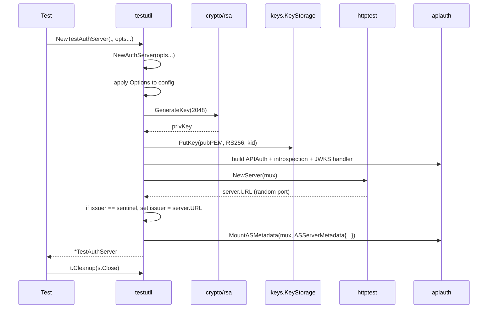
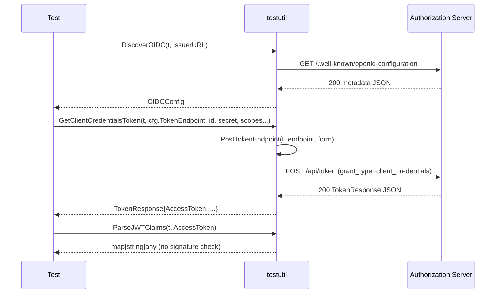
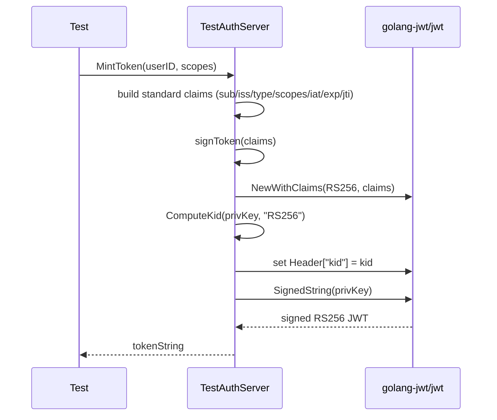

# testutil — sequence diagrams

These diagrams show the three multi-step flows in this package: building
a `TestAuthServer`, acquiring a token over HTTP, and minting a JWT
directly without hitting the token endpoint.

## Server construction

`NewTestAuthServer` is a thin shim over `NewAuthServer` that adds
`t.Cleanup`. Construction generates the RSA key, stores it in the
in-memory key store, wires the OAuth handlers into an `httptest.Server`,
and then patches the issuer with the random server URL before mounting
the AS-metadata handler.

## Token acquisition over HTTP

The standalone helpers compose into a complete RFC 6749 flow: discover
the AS, POST a grant to the token endpoint, and (optionally) parse the
returned JWT for assertions.

## Direct JWT minting (fast path)

Minting bypasses the HTTP token endpoint entirely. The server signs the
JWT with its in-memory private key and stamps the same `kid` that JWKS
publishes, so consumers can still verify via the standard JWKS path.

For negative tests, callers use `MintTokenWithClaims` and pre-populate
the claims map with bad values; the defaults loop only fills in
`iss`/`iat`/`exp` when the caller has NOT already set them.
